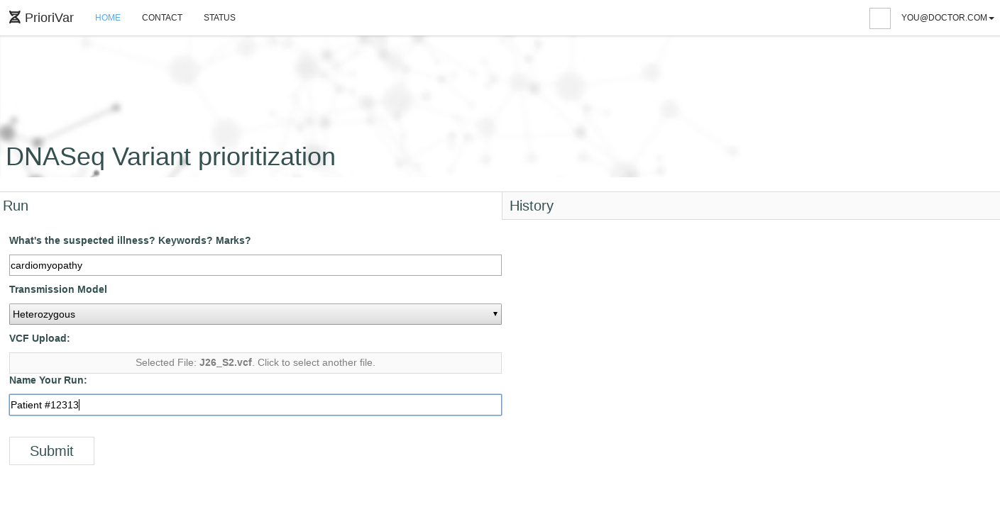
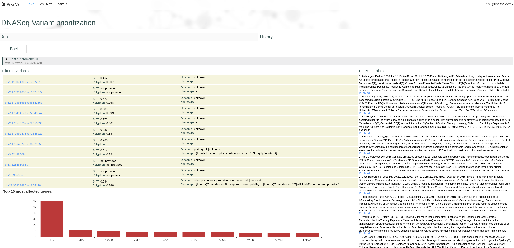

# PrioriVar - Kegnomics team frontend

Base site wrapper from:  https://github.com/sahat/hackathon-starter

Making the lives of doctors easier through automatic insights from genetic analysis results.

# Table of Contents:

* Screenshots
* Installation
* Configuration

## 1. Screenshots

Main submission page:



Post-processing results:



## 2. Installation

First run npm install in both folders, `site` and `reactclient`.

Then start the server using `npm start` in `site` and `./node_modules/.bin/webpack` in `reactclient`.


## 3. Configuration

In order to configure the URL's the service is pointing to, you have a few options

* `FRONTEND_URL` - Points to the server the frontend is on now, enabling loading of static resources like files, images, etc.
* `API_URL` - Points to the keg-api installation location. Should be `http://localhost:5000/api/` by default.

To start the server with modified variables, add the names to the run command. Example:

```
API_URL=http://35.234.120.86:5000/api/ ./node_modules/.bin/webpack
```


